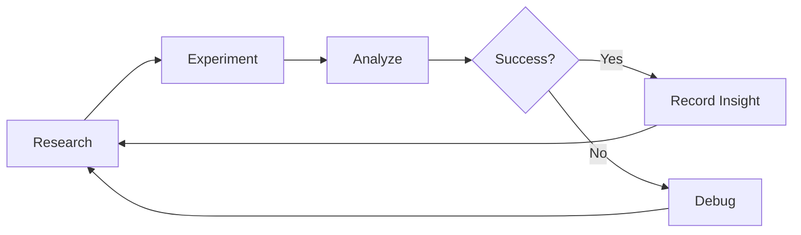

---
hide:
  - navigation
---

<div class="hero" markdown>

# ResearchPad

**AI-powered autonomous ML experimentation**
{ .subtitle }

Track experiments, surface insights, and debug models -- all from your editor.

[Get Started](getting-started/installation.md){ .md-button .md-button--primary }
[View on GitHub](https://github.com/researchpad/researchpad){ .md-button }

</div>

## Quick Start

```bash
pip install researchpad
researchpad init
researchpad runserver
```

Then open [http://localhost:8888](http://localhost:8888) and start experimenting.

## Features

<div class="grid" markdown>

<div class="card" markdown>
### :material-view-dashboard: Dashboard
A real-time overview of every experiment in your project. See status, metrics, and trends at a glance.
</div>

<div class="card" markdown>
### :material-flask: Experiments
Log each training run automatically. Compare hyperparameters, metrics, and outcomes across iterations.
</div>

<div class="card" markdown>
### :material-book-search: Research
Capture literature reviews, hypotheses, and background research as structured artifacts tied to your experiments.
</div>

<div class="card" markdown>
### :material-bug: Debug
Analyze failing runs with structured debug reports. Pinpoint root causes and track fixes over time.
</div>

<div class="card" markdown>
### :material-lightbulb: Insights
Accumulate learnings across experiments into a living knowledge base that grows with your project.
</div>

</div>

## How It Works

ResearchPad follows an **autonomous experiment loop**:

1. **Research** -- Gather context, review literature, form hypotheses.
2. **Experiment** -- Run a training iteration and log results automatically.
3. **Analyze** -- The dashboard surfaces trends, regressions, and wins.
4. **Debug** -- When something goes wrong, generate structured debug reports.
5. **Learn** -- Insights accumulate so you never repeat a dead end.

All data lives in a local `.researchpad/` directory inside your project -- no cloud accounts, no vendor lock-in.



## Zero Dependencies

ResearchPad has **no Python runtime dependencies**. The CLI is pure Python; the UI is a self-contained Node.js server bundled into the package. Install it and go.

---

Ready to get started? Head to the [Installation Guide](getting-started/installation.md).
